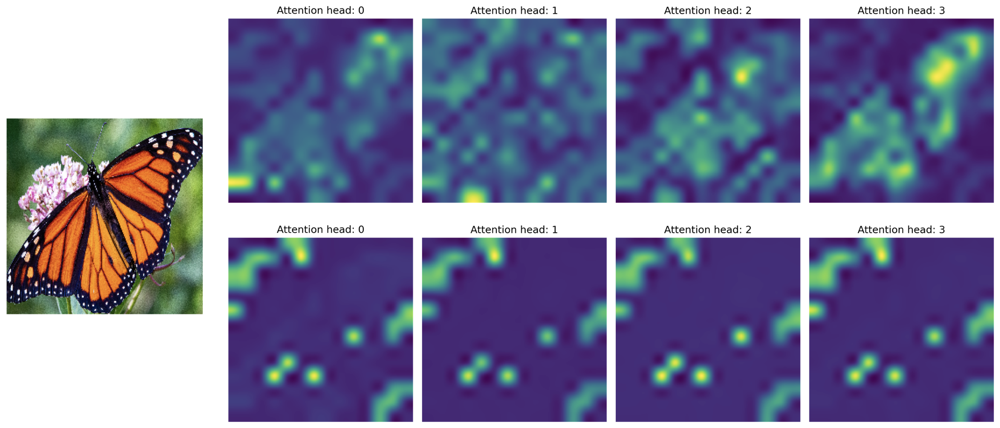

# CaiT-TF (Going deeper with Image Transformers)

This repository provides TensorFlow / Keras implementations of different CaiT
[1] variants from Touvron et al. It also provides the TensorFlow / Keras models that have been
populated with the original DeiT pre-trained params available from [2]. These
models are not blackbox SavedModels i.e., they can be fully expanded into `tf.keras.Model`
objects and one can call all the utility functions on them (example: `.summary()`).

As of today, all the TensorFlow / Keras variants of the **CaiT** models listed
[here](https://github.com/facebookresearch/deit#model-zoo) and [here](https://github.com/rwightman/pytorch-image-models/blob/master/timm/models/cait.py) are available in this repository. The model checkpoints will be
available on TF-Hub soon, stay tuned!

Refer to the ["Using the models"](https://github.com/sayakpaul/cait-tf#using-the-models)
section to get started. 

## Table of contents

* [Conversion](https://github.com/sayakpaul/cait-tf#conversion)
* [Collection of pre-trained models (converted from PyTorch to TensorFlow)](https://github.com/sayakpaul/cait-tf#models)
* [Results of the converted models](https://github.com/sayakpaul/cait-tf#results)
* [How to use the models?](https://github.com/sayakpaul/cait-tf#using-the-models)
* [References](https://github.com/sayakpaul/cait-tf#references)
* [Acknowledgements](https://github.com/sayakpaul/cait-tf#acknowledgements)

## Conversion

TensorFlow / Keras implementations are available in `cait/models.py`. Conversion
utilities are in `convert.py`.

## Models

Find the models on TF-Hub here: https://tfhub.dev/sayakpaul/collections/cait/1. You can fully inspect the
architecture of the TF-Hub models like so:

```py
import tensorflow as tf

model_gcs_path = "gs://tfhub-modules/sayakpaul/cait_xxs24_224/1/uncompressed"
model = tf.keras.models.load_model(model_gcs_path)

dummy_inputs = tf.ones((2, 224, 224, 3))
_ = model(dummy_inputs)
print(model.summary(expand_nested=True))
```

## Results

Results are on ImageNet-1k validation set (top-1 and top-5 accuracies). 

| model_name     |   top1_acc(%) |   top5_acc(%) |
|:---------------:|:--------------:|:--------------:|
| cait_s24_224   |        83.368 |        96.576 |
| cait_xxs24_224 |        78.524 |        94.212 |
| cait_xxs36_224 |        79.76  |        94.876 |
| cait_xxs36_384 |        81.976 |        96.064 |
| cait_xxs24_384 |        80.648 |        95.516 |
| cait_xs24_384  |        83.738 |        96.756 |
| cait_s36_384   |        85.192 |        97.372 |

<small>*Results for the rest of the models will be updated soon.</small>

Results can be verified with the code in `i1k_eval`. Results are in line with [1].


## Using the models

**Pre-trained models**:

* Off-the-shelf classification: [Colab Notebook](https://colab.research.google.com/github/sayakpaul/cait-tf/blob/main/notebooks/classification.ipynb)
* Fine-tuning: [Colab Notebook](https://colab.research.google.com/github/sayakpaul/cait-tf/blob/main/notebooks/finetune.ipynb)

These models also output attention weights from each of the Transformer blocks.
Refer to [this notebook](https://colab.research.google.com/github/sayakpaul/cait-tf/blob/main/notebooks/classification.ipynb)
for more details. Additionally, the notebook shows how to visualize the attention maps for a given image (following
figures 6 and 7 of the original paper).

| Original Image | Class Attention Maps | Class Saliency Map |
| :--: | :--: | :--: |
|  |  |  |
 
**Randomly initialized models**:
 
```py
from cait.model_configs import base_config
from cait.models import CaiT
import tensorflow as tf
 
config = base_config.get_config(
    model_name="cait_xxs24_224"
)
cait_xxs24_224 = CaiT(config)

dummy_inputs = tf.ones((2, 224, 224, 3))
_ = cait_xxs24_224(dummy_inputs)
print(cait_xxs24_224.summary(expand_nested=True))
```

To initialize a network with say, 5 classes, do:

```py
config = base_config.get_config(
    model_name="cait_xxs24_224"
)
with config.unlocked():
    config.num_classes = 5
cait_xxs24_224 = CaiT(config)
```

To view different model configurations, refer to `convert_all_models.py`.

## References

[1] CaiT paper: https://arxiv.org/abs/2103.17239

[2] Official CaiT code: https://github.com/facebookresearch/deit

## Acknowledgements

* [`timm` library source code](https://github.com/rwightman/pytorch-image-models)
for the awesome codebase.
* [ML-GDE program](https://developers.google.com/programs/experts/) for
providing GCP credits that supported my experiments.
